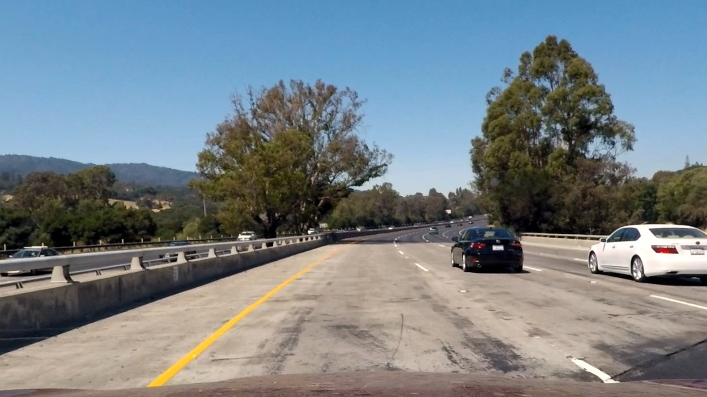
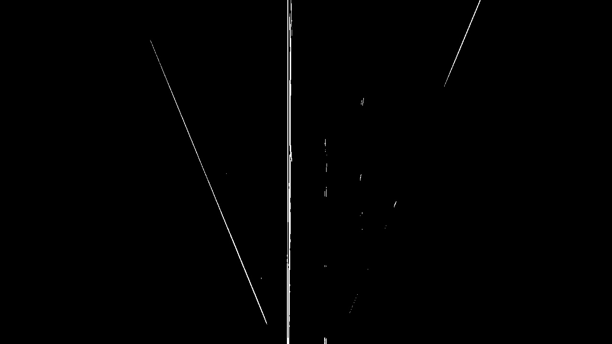

# Advanced Lane Lines

Author : Manoj Kumar Subramanian

------

## Overview

This repository is as part of my Submission to the Project 4: Advanced Lane Lines Project for the Udacity Self Driving Car Nano Degree Program.

In this project, the lane lines are found in a video file using the Computer Vision technique. The coding is done in Python and below report details the list of activities done on this project.

------

## Project Goals

The goals of this project are the following:

- Compute the camera calibration matrix and distortion coefficients given a set of chessboard images.
- Apply a distortion correction to raw images.
- Use color transforms, gradients, etc., to create a thresholded binary image.
- Apply a perspective transform to rectify binary image ("birds-eye view").
- Detect lane pixels and fit to find the lane boundary.
- Determine the curvature of the lane and vehicle position with respect to center.
- Warp the detected lane boundaries back onto the original image.
- Output visual display of the lane boundaries and numerical estimation of lane curvature and vehicle position.

------


## Rubric Points##

### Writeup / README###

This README document acts as the submission to meet the Rubric point related to Writeup. The steps followed to achieve the goals is described in the following sections of this document.

------

### Camera Calibration###

- As mentioned in the lecture slides to use the  *<u>cv2.findChessboardCorners()</u>* and *<u>cv2.calibrateCamera()</u>* functions from the cv2 library, the camera calibration is performed.
- For the camera used in the project video, the different images capturing the Chessboard in different angles were provided in the "*<u>camera_cal</u>*" folder.
- When looked upon the chessboard, the number of corners visible were 9x6 and hence the code is made to look for 9x6 corners in the images.
- Though in 3 images, all the corners were not visible, with the help of remaining 17 images, the camera calibration matrix was found and stored in a pickle file. This is a one time operation when the program is started for the first time and whenever a pickle file is found, the code picks the calibration parameters directly from this file.
- The cv2.undistort() function is used to perform the un-distortion operation on the image.

| Original Image                           | Undistorted Image                        |
| ---------------------------------------- | ---------------------------------------- |
|  |  |

------

### Pipeline (test images)###

The pipeline is started with to test the static images keeping the progress of operations.

**<u>1. Example for distortion correction:</u>**

Below table provides, the distortion correction on the sample image.

| Original Image                  | Undistorted Image                        |
| ------------------------------- | ---------------------------------------- |
|  |  |

**<u>2. Perspective transform:</u>**

With reference to the operations mentioned in the [Mathworks Lane Detection example](https://in.mathworks.com/help/visionhdl/examples/lane-detection.html), I tried out the method of performing the perspective transform prior to the binarization of the image.

1. The straight_lines.jpg image is used find the corner points of the trapezoid for performing the perspective transformation.  The points were found out to be 

```python
    src = np.float32([[592,450],[682,450],[1116,720],[200,720]])
```

2. The transformation is performed using cv2.getPerspectiveTransform() function and the following is the output of the transform made on one of the test image. 

   ​

**<u>3. Binary Image</u>**

I have made the general functions for performing channel wise thresholding of the image in the ImgFilterProcess.py file. But the approach, I have used has not utilized the thresholding on the Raw images. The project_video_output.mp4 video has not used the color thresholding directly but used the gradient wise binarization followed by thresholding.

<u>Steps:</u>

1. I have applied sobel operator on the warped image in the 'x' direction to with cv2.CV_64F format so that both the positive and negative gradients can be identified.

   ```python
       #Applied sobel in x direction to get the vertical lines detected
       #CV_64F is used to find both positive and negative gradients
       sobel_img = cv2.Sobel(warp_img, cv2.CV_64F, 1, 0)
   ```

   

2. Then I used the following snippet to convert the 64F float to 8-bit unsigned since the negatives are shown as black.

   ```python
       #Converted the 64F output to Uint8
       minx = np.min(sobel_img)
       sobel_img = sobel_img-minx #to have only positive values
       maxx=np.max(sobel_img) 
       div = maxx / float(255) #calculate the normalize divisor
       if div == 0:
           div = 1
       sobelx_8u = np.uint8(np.round(sobel_img / div))
   ```

   

3. Note that the converted image has clear both positive and negative gradients back to back for a line.

4. The yellow line is extracted through the s channel of this image and the white line through the R channel of the image.

   | Sobel R Channel                     | Sobel S Channel                      |
   | ----------------------------------- | ------------------------------------ |
   |    |     |
   | **Thresholds to White**             | **Thresholds to Yellow**             |
   |  |  |

   ​

5. The combined binary after masking only to the region of interest to avoid the v shaped portion is as below.

   

   ​

**<u>4. Lane Finding</u>**

1. A Line class is formed to create instances of Left and Right lanes separately.

2. For the left lane, the initial search is performed on the portion left side from the center of the image and for the right lane, the search is done on the right side portion of the image.

3. The method of sliding window convolution approach as per the lecture slides is used to find out the lane fit for the first frame.

4. Once the fit is created, the find_lanes_limited function is used to search for the margin area in the next frame.

5. Based on the fits from both the lines, the lanes are filled with colour to highlight in the output.

   | Lane fit for both left and right lanes | Lane filled with highlight colour |
   | -------------------------------------- | --------------------------------- |
   |         |        |

**<u>5. Lane Curvature calculation</u>**

1. The Line class is used for find the curvature of its instance as mentioned per the lecture slides.
2. Since the image frame starts y value from the top, we need to invert the equations to match to our vehicle origin which is at the bottom center.
3. The conversion for x is **<u>3.7m/80</u>** since the standard lane width is 3.7 and as per our warped image it covers 80 pixels.
4. The conversion for y is approx. **32m/720**
5. The same code as per in the lectures were used to find the curvature for each of the lane lines.
6. From the modified fit of second order polynomial, at 0m from the vehicle, i.e at y=0, the polynomial is reduced to only the constant term. 
7. Hence by comparing the constant terms of both left and right lines, we get the lane distance between both lines which gives the lane width.
8. This lane width term is used for sanity check to reset the lane finding algorithm to sliding window based if there are any deviations in the width

**<u>6. Lane marked back onto the original image</u>**

The below image shows the output of the pipeline for the test image.


------

### Pipeline (Video)###

1. The pipeline is enhanced for the video frames by adding the average over last n detections which act as a smoothing factor to avoid jittery.
2. The line class is appended with the recent detections for the window centroids, lane fits and the lane curvatures to provide an averaged value.

The output of the project video is available [here](project_video_out.mp4).

------

### Discussion Points###

Since most of the lane detection cameras used in the current production vehicles are of monochrome type with enough robustness on lane detections, the method I followed to use only the gradients should be sufficient with more fine tuning on proper lane detection. But the usage of color and other color conversion channels provide additional supports to enhance the algorithms based on only computer vision.

The gradient only approach provides comparatively good results even on the harder_challenge_video (the detections are more robust than using the color channels in the harder_challenge_video), but this still fails in a number of occasions.

Few areas of development on this project is to work for a smoothing filter with the confidence level on the lane detections and to have weighted average with the weights given for higher confidence detections. Also to add few more sanity checks like comparing the radius of curvatures of both the lines, approximate parallelism between the lines shall be considered.

